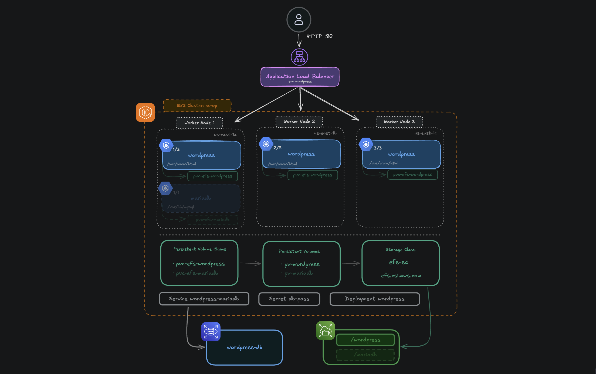
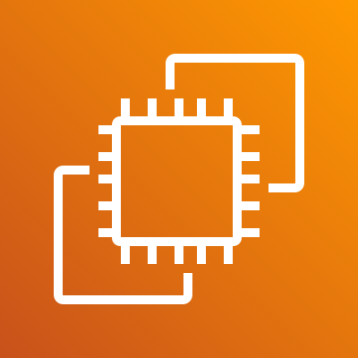

# Architecture



## Services Used

| Service | Role |
|---|---|
|  **Amazon EKS** | Managed Kubernetes cluster — orchestrates WordPress pods across three worker nodes (one per AZ) |
|  **Application Load Balancer** | Exposes WordPress to the internet on port 80; automatically provisioned via a `Service` of type `LoadBalancer` |
|  **EFS** | Shared persistent filesystem for WordPress files (`/var/www/html`); mounted with ReadWriteMany across all pods |
|  **RDS MySQL** | Managed relational database for all WordPress data (Phase 2); replaces the in-cluster MariaDB pod |
|  **EC2 Worker Nodes** | Three nodes spread across `us-east-1a`, `us-east-1b`, `us-east-1c` running the WordPress (and Phase 1 MariaDB) pods |
|  **VPC / Security Groups** | Network isolation — RDS and EFS are only reachable from within the VPC; no public endpoints exposed |

## Kubernetes Resources Summary

| Resource | Kind | Purpose |
|---|---|---|
| `wordpress` | Service / LoadBalancer | Exposes WordPress to the internet via ALB |
| `wordpress-mariadb` | Service / ClusterIP (Phase 1) or ExternalName (Phase 2) | Internal DNS for the database within the cluster |
| `wordpress` | Deployment | WordPress container (3 replicas in Phase 2) |
| `wordpress-mariadb` | Deployment | MariaDB container (Phase 1 only) |
| `pvc-efs-wordpress` | PersistentVolumeClaim | Reserves EFS storage for WordPress files |
| `pvc-efs-mariadb` | PersistentVolumeClaim | Reserves EFS storage for MariaDB data (Phase 1 only) |
| `pv-wordpress` / `pv-mariadb` | PersistentVolume | Static EFS-backed volumes bound to the PVCs |
| `efs-sc` | StorageClass | Links Kubernetes storage requests to the EFS CSI driver (`efs.csi.aws.com`) |
| `db-pass` | Secret | Stores the database password, injected as environment variable into pods |

## Security Group Rules Summary

| Security Group | Allows | From |
|---|---|---|
| EKS Node SG | All traffic between nodes | EKS Node SG (self-referencing) |
| EFS Mount Target SG | NFS 2049 | EKS Node SG only |
| RDS SG | MySQL 3306 | EKS Node SG only |
| ALB SG | HTTP 80 | 0.0.0.0/0 |

## Data Flow

1. Client sends an HTTP request to the ALB DNS name on port 80
2. ALB forwards the request to one of the healthy WordPress pods (round-robin across nodes)
3. WordPress resolves `wordpress-mariadb:3306` via cluster DNS
   - **Phase 1** → routes to the MariaDB pod inside the cluster
   - **Phase 2** → `ExternalName` service transparently redirects to the RDS endpoint
4. WordPress reads/writes application data to the database (MariaDB or RDS)
5. File uploads and plugin assets are read/written to the shared EFS volume mounted at `/var/www/html`
6. All pods share the same EFS mount → uploaded files are consistent regardless of which pod handles the request

## Two-Phase Architecture

### Phase 1 — WordPress + MariaDB on EFS

Both WordPress and MariaDB run as pods inside the cluster. Each uses a dedicated EFS Access Point (`/wordpress` for UID 33, `/mariadb` for UID 999) so their data stays isolated on the same filesystem. A headless `ClusterIP` service named `wordpress-mariadb` provides internal DNS resolution to the database pod.

**Limitations:**
- EFS uses NFS under the hood — high latency for database I/O
- Single MariaDB pod is a single point of failure with no horizontal scaling

### Phase 2 — WordPress + RDS (EFS for files only)

MariaDB is replaced by a managed **RDS MySQL** instance. An `ExternalName` service still named `wordpress-mariadb` transparently points to the RDS endpoint — the WordPress deployment requires **zero changes**. WordPress scales to 3 replicas sharing a single EFS mount with `ReadWriteMany` access.

## Storage Layout

```
EFS File System (fs-XXXXXXXX)
├── /wordpress   ← Access Point fsap-XXXXXXXX (UID 33, perms 755)
│   └── wp-content, wp-includes, ...   (shared by all WordPress pods)
└── /mariadb     ← Access Point fsap-YYYYYYYY (UID 999, perms 750)
    └── mysql data files               (Phase 1 only)
```

## Security Notes

- MariaDB (Phase 1) and RDS (Phase 2) have no public endpoint — only reachable from within the VPC
- The database password is stored as a Kubernetes `Secret` (`db-pass`) and injected at runtime, never hardcoded in manifests
- EFS Access Points enforce POSIX UID/GID ownership, preventing cross-service data access on the shared filesystem
- In production: enable RDS Multi-AZ, automated backups, encryption at rest, and EFS transit encryption