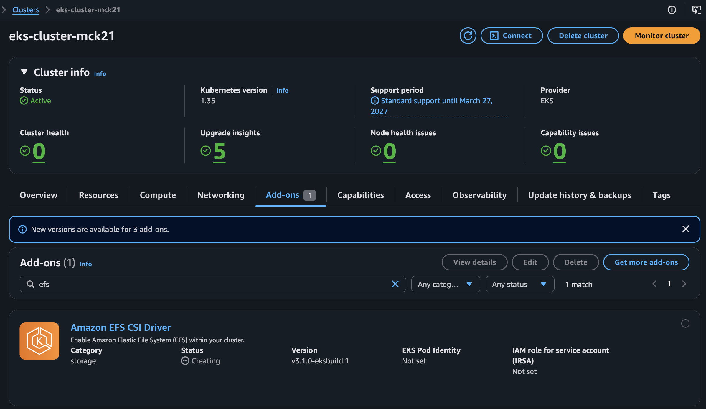
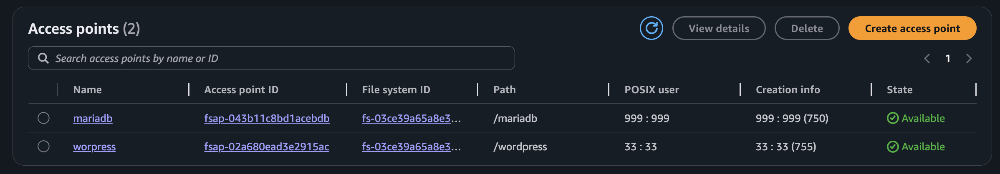
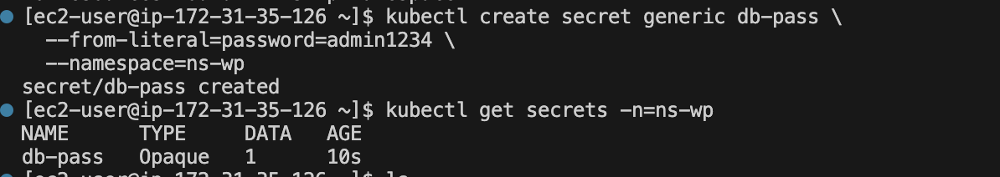
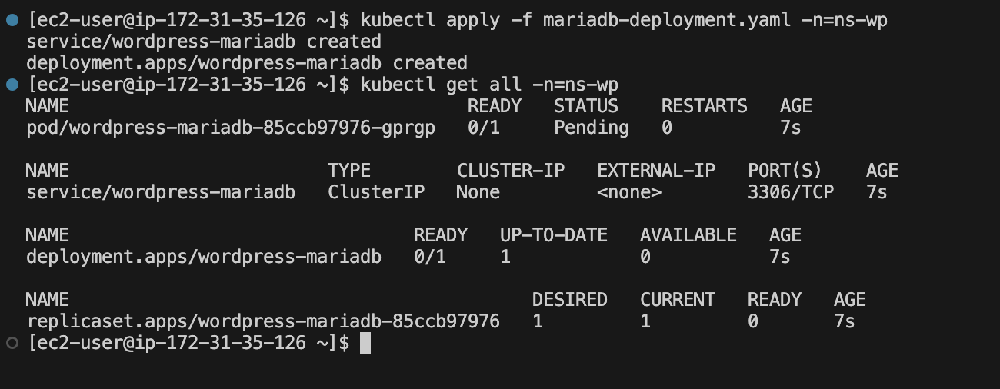
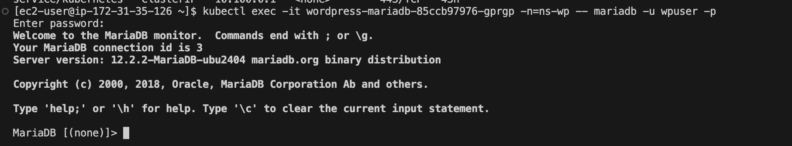
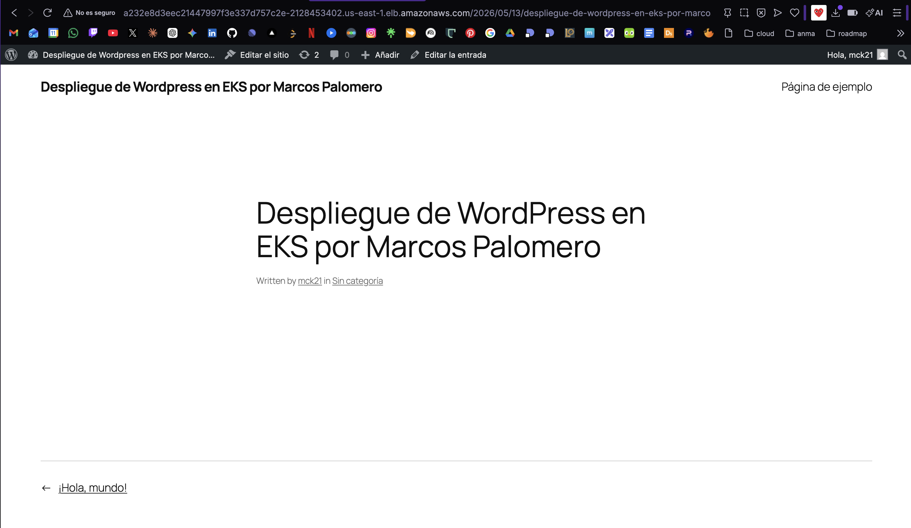
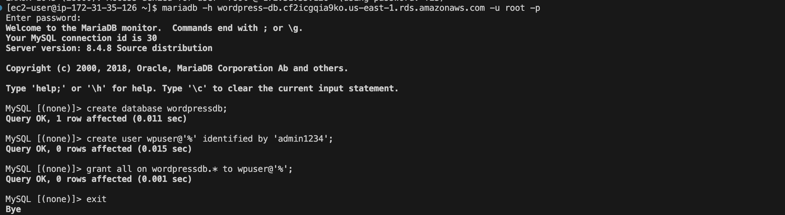
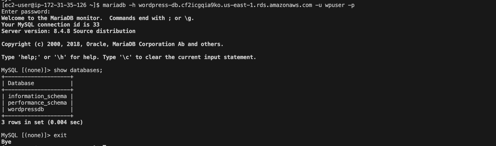
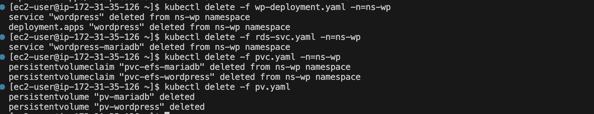

# Step-by-Step Deployment Guide

## Prerequisites

- EKS cluster running (`my-cluster`, region `us-east-1`) with worker nodes
- EC2 instance with VSCode and `kubectl` installed
- AWS CLI configured with valid session credentials
- EFS CSI Driver add-on installed on the cluster

---

## Step 1 — Verify cluster connectivity

Update AWS credentials if the lab session has rotated:

```bash
aws configure
# or edit directly:
nano ~/.aws/credentials
```

Verify kubectl can reach the cluster:

```bash
kubectl config get-clusters
```

If it fails or the cluster is missing, regenerate the kubeconfig:

```bash
aws eks update-kubeconfig --name my-cluster --region us-east-1
```

> **Evidence:** Cluster created and reachable.



---

## Step 2 — Install EFS CSI Driver

From the AWS Console → **EKS → your cluster → Add-ons**, check whether `Amazon EFS CSI Driver` is listed. If not, add it via *Get more add-ons* (no IAM role required for the lab).

Verify the controller is running:

```bash
kubectl get all -n=kube-system | grep efs
# Expected: efs-csi-controller pod in Running state
```

---

## Step 3 — Create the EFS file system

AWS Console → **EFS → Create file system → Customize**:

| Option | Value |
|---|---|
| Availability | Regional |
| Backups | Disabled |
| Lifecycle policy | Disabled |
| Encryption | Disabled |
| Performance mode | Bursting |
| Subnets | us-east-1a, us-east-1b, us-east-1c (same as EKS cluster) |
| Security groups | EKS cluster SGs + vscode instance SG (remove default) |

Once created, note the **File System ID** (`fs-XXXXXXXX`).

### Create two Access Points

**Access Point — mariadb:**

| Field | Value |
|---|---|
| Name | mariadb |
| Root directory path | /mariadb |
| POSIX User ID | 999 |
| POSIX Group ID | 999 |
| Owner User ID | 999 |
| Owner Group ID | 999 |
| Permissions | 750 |

**Access Point — wordpress:**

| Field | Value |
|---|---|
| Name | wordpress |
| Root directory path | /wordpress |
| POSIX User ID | 33 |
| POSIX Group ID | 33 |
| Owner User ID | 33 |
| Owner Group ID | 33 |
| Permissions | 755 |

> **Why these UIDs?** The official MariaDB Docker image runs as UID 999 and WordPress as UID 33 (www-data). Setting matching UIDs on the Access Points lets pods create their directories on first boot without manual intervention.

Note both **Access Point IDs** (`fsap-XXXXXXXX`).

> **Evidence:** Both EFS Access Points created.



---

## Step 4 — Create the namespace

```bash
kubectl create namespace ns-wp
kubectl get all -n=ns-wp
# No resources found — expected
```

---

## Step 5 — Create the DB password secret

```bash
kubectl create secret generic db-pass \
  --from-literal=password=YOUR_PASSWORD \
  --namespace=ns-wp

kubectl get secrets -n=ns-wp
```

> **Evidence:** Secret `db-pass` created in namespace `ns-wp`.



---

## Step 6 — Storage: StorageClass, PVs and PVCs

### StorageClass

`iac/01-storageclass.yaml` — apply as-is, no changes needed:

```bash
kubectl apply -f iac/01-storageclass.yaml -n=ns-wp
kubectl get sc -n=ns-wp
```

### PersistentVolumes

Edit `iac/02-pv.yaml` and replace the `volumeHandle` values with your real IDs:

```yaml
# Format: <EFS_FILE_SYSTEM_ID>::<ACCESS_POINT_ID>
volumeHandle: fs-XXXXXXXX::fsap-AAAAAAAA   # mariadb AP
volumeHandle: fs-XXXXXXXX::fsap-BBBBBBBB   # wordpress AP
```

```bash
kubectl apply -f iac/02-pv.yaml -n=ns-wp
kubectl get pv -n=ns-wp
# pv-mariadb and pv-wordpress should appear as Available
```

### PersistentVolumeClaims

```bash
kubectl apply -f iac/03-pvc.yaml -n=ns-wp
kubectl get pvc -n=ns-wp
# Both PVCs should show as Bound
```

---

## Step 7 — Deploy MariaDB

```bash
kubectl apply -f iac/04-mariadb.yaml -n=ns-wp
kubectl get all -n=ns-wp
```

> **Evidence:** MariaDB deployment running.



Verify DB access (replace pod name with yours):

```bash
kubectl exec -it wordpress-mariadb-XXXXXX -n=ns-wp -- mariadb -u wpuser -p
```

> **Evidence:** Successful connection to MariaDB pod.



---

## Step 8 — Deploy WordPress (Phase 1)

```bash
kubectl apply -f iac/05-wp-deployment.yaml -n=ns-wp
kubectl get all -n=ns-wp
```

The `wordpress` Service will show a DNS name under `EXTERNAL-IP` once the ALB is provisioned (takes 1-2 minutes). Open that URL in a browser to complete the WordPress installer.

> **Evidence:** WordPress deployment running and accessible via load balancer.



### 📸 Evidence checkpoint (after Step 8 / exercise 7)

```bash
kubectl get pvc -n=ns-wp
kubectl get all -n=ns-wp
```

> **Evidence:** PVCs bound and all Phase 1 resources running.


---

## Step 9 — Migrate database to RDS (Phase 2)

### Remove current deployments

```bash
kubectl delete -f iac/05-wp-deployment.yaml -n=ns-wp
kubectl delete -f iac/04-mariadb.yaml -n=ns-wp
kubectl get all -n=ns-wp   # should be empty
```

Clean the WordPress EFS directory to avoid conflicts on re-deploy (if EFS is mounted on the vscode instance):

```bash
sudo rm -rf /mnt/efs/wordpress
```

### Create RDS instance

AWS Console → **RDS → Create database**:

| Option | Value |
|---|---|
| Engine | MySQL |
| Template | Dev/Test |
| Deployment | Single-AZ (1 instance) |
| Identifier | wordpress-db |
| Master username | root |
| Master password | (set and note it) |
| Instance type | db.t3.micro |
| Storage | 20 GB, disable autoscaling |
| Security groups | EKS cluster SGs + vscode instance SG |
| Availability Zone | us-east-1a |
| Enhanced Monitoring | Disabled |
| Automatic backups | Disabled |

Note the **Endpoint** once the instance reaches `Available` status.

> **Evidence:** RDS `wordpressdb` instance created and available.



### Create the database and user

Install the MariaDB client on the vscode instance:

```bash
sudo dnf install mariadb105
```

Connect as root and create the schema:

```bash
mariadb -h YOUR-RDS-ENDPOINT.rds.amazonaws.com -u root -p
```

```sql
CREATE DATABASE wordpressdb;
CREATE USER wpuser@'%' IDENTIFIED BY 'YOUR_PASSWORD';
GRANT ALL ON wordpressdb.* TO wpuser@'%';
EXIT;
```

> The password must match the one stored in the `db-pass` Secret created in Step 5.

Verify with the WordPress user:

```bash
mariadb -h YOUR-RDS-ENDPOINT.rds.amazonaws.com -u wpuser -p
SHOW DATABASES;
EXIT;
```

> **Evidence:** `wpuser` can connect and see `wordpressdb`.



### Create the ExternalName Service

Edit `iac/06-rds-svc.yaml` and replace `externalName` with your RDS endpoint:

```bash
kubectl apply -f iac/06-rds-svc.yaml -n=ns-wp
kubectl get svc -n=ns-wp
```

> The Service is named `wordpress-mariadb` — same as the headless Service from Phase 1. WordPress resolves the DB host by this name, so **no changes to the WordPress manifest are needed**.

### Re-deploy WordPress

```bash
kubectl apply -f iac/05-wp-deployment.yaml -n=ns-wp
kubectl get all -n=ns-wp
```

Access the load balancer DNS again and reconfigure WordPress (the DB is empty).

---

## Step 10 — Scale to 3 replicas

Test self-healing first (replace pod name with yours):

```bash
kubectl get pods -n=ns-wp -o wide
kubectl delete pod/wordpress-XXXXXX -n=ns-wp
kubectl get pods -n=ns-wp   # new pod should appear immediately
```

Edit `iac/05-wp-deployment.yaml` and add `replicas: 3` to the Deployment spec:

```yaml
spec:
  replicas: 3
  selector:
    ...
```

Apply:

```bash
kubectl apply -f iac/05-wp-deployment.yaml -n=ns-wp
kubectl get pods -n=ns-wp -o wide
# 3 pods distributed across nodes
```

### 📸 Evidence checkpoint (after Step 10 / exercise 9)

```bash
kubectl get pvc -n=ns-wp
kubectl get all -n=ns-wp
```

> **Evidence:** PVCs bound and 3 WordPress replicas running with RDS backend.


---

## Step 11 — Cleanup

```bash
kubectl delete -f iac/05-wp-deployment.yaml -n=ns-wp
kubectl delete -f iac/06-rds-svc.yaml -n=ns-wp
kubectl delete -f iac/03-pvc.yaml -n=ns-wp
kubectl delete -f iac/02-pv.yaml
```

From the AWS Console, delete in this order to avoid dependency errors:

1. EKS Worker Nodes (node group)
2. EKS Cluster
3. RDS instance
4. EFS file system

> **Evidence:** All Kubernetes resources deleted before tearing down AWS infrastructure.

